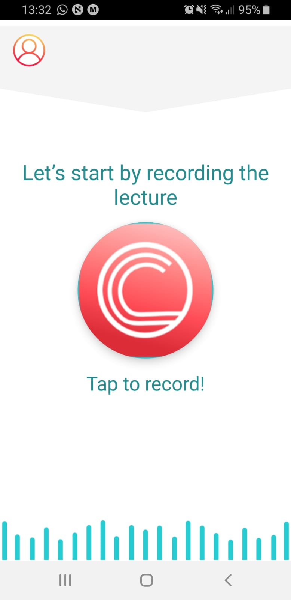
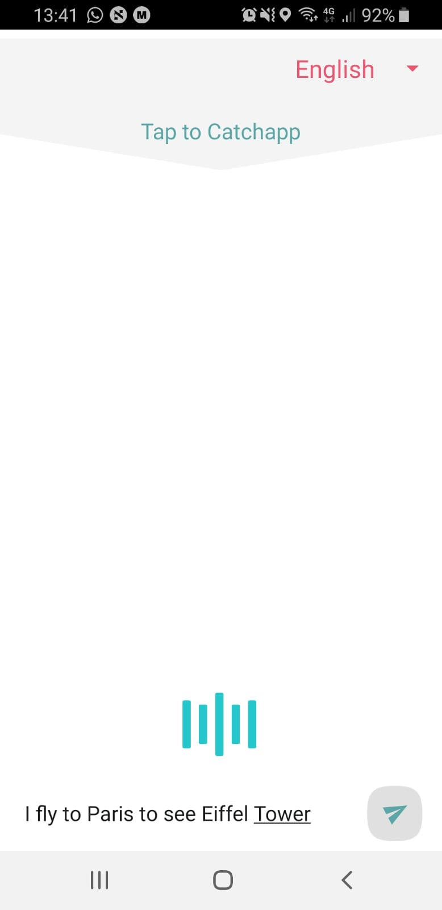
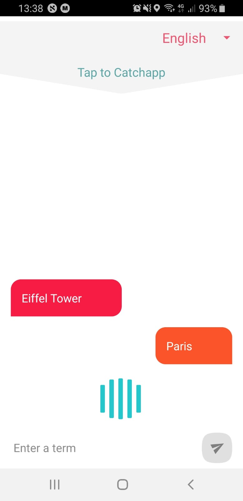
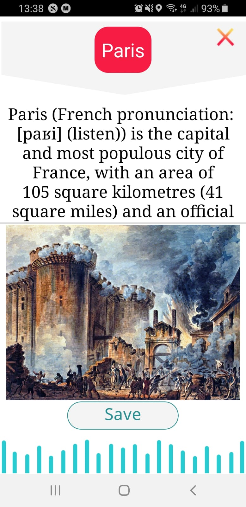
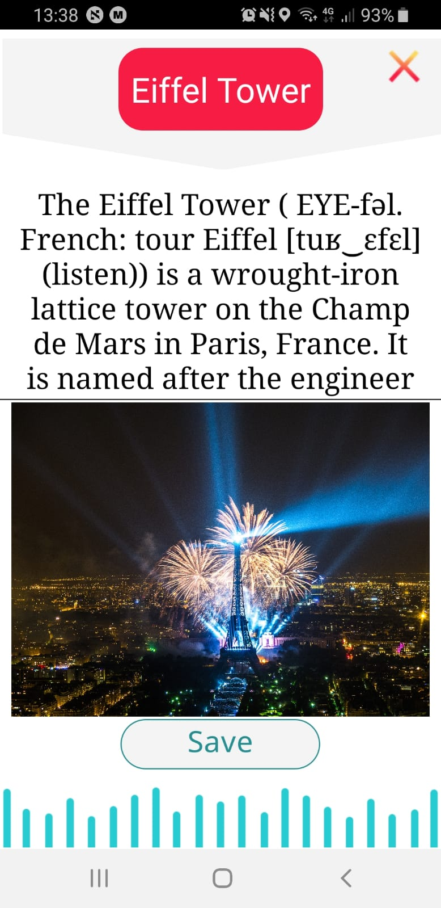
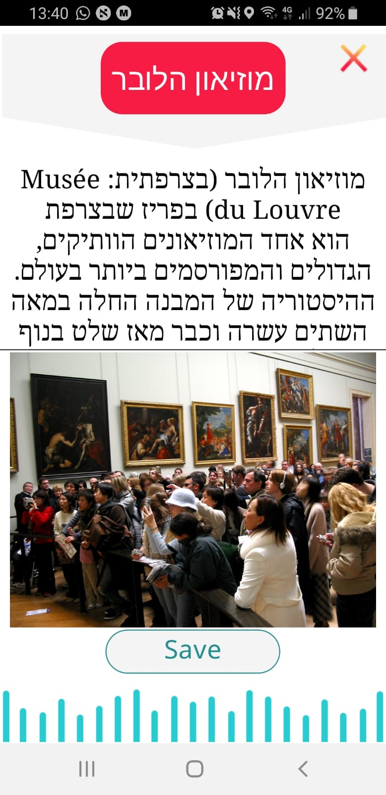

# CatchApp - Android Application
**CatchApp** is a mobile app designed for students who do not study in their native language. The purpose of the app is to help these students maintain a high level of learning and understanding while not harming the proper course of the lesson. The app listens to the lecture in real time and knows how to identify the professional terms the teacher says. It translates these terms into the student's native language and sends it back to him. In addition, the student can save the professional terms for later and use them while writing a paper, studying for exams or when reviewing the material.

CatchApp is an academic project that was developed in the Media Innovation Lab (miLAB) of the Sammy Ofer School of Communication in IDC Herzliya.
[Google Play - CatchApp](https://play.google.com/store/apps/details?id=com.catchapp.nitai.client_nitai)

## Video

## Screenshots

